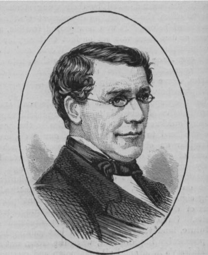

# A cifra de Playfair

O objetivo desse trabalho é a construção de um programa que realize a cifragem e a decifragem de um texto utilizando a criptografia de Playfair. Ele demandará de conhecimento dos assuntos de strings, matrizes e um pouco de arquivos.

O conteúdo dessa seção é retirada do site abaixo. Apenas os conteúdos mais importantes foram copiados pra cá. Sugiro que você leia na íntegra no seguinte [site](http://www.numaboa.com.br/criptografia/substituicoes/poligramicas/1041-playfair).

## História

Apesar do nome do Barão de Playfair estar associado a uma das cifra clássicas mais conhecidas, foi seu amigo, o cientista Charles Wheatstone, quem a concebeu. Após sua criação em 1854, o barão conseguiu que o governo britânico adotasse oficialmente o uso da cifra - daí o nome Cifra de Playfair.

A Playfair é uma cifra de bloco primitiva, usando alguns princípios comuns às cifras de bloco atuais. O melhor meio de se aproximar da criptologia moderna, sem ter que enfrentar a teoria dos números e a matemática, é entendendo a Playfair.

As letras são tomadas duas a duas, e aplicadas a uma grade de 5 por 5 que contém o alfabeto cifrante.

A Playfair possui outras vantagens: não precisa de tabelas ou dispositivos complicados, possui uma palavra-chave que pode ser memorizada ou trocada com facilidade, é muito fácil de ser implementada e pouco sujeita a erros. Devido a estas características o sistema é perfeito para ser usado como uma \"cifra de campo\".

## Preparando o texto

A preparação do texto claro é extremamente fácil: basta formar grupos de 2 letras, os blocos digrâmicos. Cada bloco receberá um tratamento de acordo com as regras cifrantes (veja abaixo). O texto claro que será cifrado com a Playfair é:

MORRO MAS SAPRENDO C

Preparamos o texto para ser cifrado: MO RR OM AS SA PR EN DO OC

De imediato notamos que o último bloco ficou com apenas uma letra e que
existe um bloco com letra dupla (RR). Letras repetidas impedem que a
cifra possa ser aplicada corretamente. Nestes casos, convenciona-se uma
letra de separação. Geralmente são usados preferencialmente o X e o Z,
caso sejam dois XX. Caso falte uma letra no final, adiciona-se X ou Z.
Corrigindo os blocos obtemos:

    MO RX RO MA SX SA PR EN DO CX

## A matriz de cifragem

O alfabeto cifrante proposto por Wheatstone fica disposto numa grade de 5 por 5. Como o alfabeto latino possui 26 letras, é preciso eliminar uma das letras. Eliminaremos o W.

Além disto, para facilitar a memorização do cifrante, Wheatstone sugeriu começar o preenchimento da grade com uma palavra-chave. O restante das células é preenchido com as letras faltantes em ordem alfabética.

No nosso exemplo usaremos a palavra-chave \"POWER RANGER\". Ignoraremos o W e retiraremos os duplicados. Ficamos com \"POERANG\". Preenchemos a grade começando de cima pela esquerda. Depois colocamos o resto do alfabeto em ordem alfabetica.

Resultado:

    P O E R A
    N G B C D
    F H I J K
    L M Q S T 
    U V X Y Z

## Cifragem

As letras de um bloco podem ter apenas 3 localizações na grade: estão na mesma linha, estão na mesma coluna ou estão em linhas e colunas diferentes. Portanto, existem apenas 3 regras que devem ser aplicadas aos blocos digrâmicos:

1\. Letras na mesma linha são substituídas pelas letras à sua direita. Caso uma das letras do bigrama esteja na última coluna da grade, \"roda-se a linha\" e utiliza-se a letra da primeira coluna.

        Ex: PR > OA, CG > DB, ZV > UX, ZY > UZ

2\. Letras na mesma coluna são substituídas pelas letras abaixo delas. Caso a letra esteja na última linha, \"roda-se a coluna\" e utiliza-se a letra da primeira linha.

        Ex: PF > NL, PU > NP, VM > OV, FN > LF

3\. Letras em linhas e colunas diferentes: as letras do bigrama formam um \"quadrilátero\" e são substituídas pelas letras posicionadas nos cantos contrários do quadrilátero.

        Ex: PG > ON, GP > NO, PB > EN, ZP > UA

## Aplicando a grade

Nosso texto e nossa grade ficarm assim.

    Texto claro:
    MO RX RO MA SX SA PR EN DO CX

    Grade:

    P O E R A
    N G B C D
    F H I J K
    L M Q S T 
    U V X Y Z

Cifrando usando as regras temos:

    Texto claro:
    MO RX RO MA SX SA PR EN DO CX
    Texto cifrado:
    VG EY AE TO QY TR OA PB GA BY

Para descriptografar é só fazer as operações contrárias.

## O programa

Você deve fazer criptografar e descriptografar. Ao ser executado ele
receberá o nome do arquivo que contém o texto por parametro e perguntará
a senha ao usuário. Ele mostrará o texto processado na tela.

    --Conteúdo de texto.txt
    MORRO MAS SAPRENDO C 

    --Rodando o programa:
    # ./cifrar texto.txt
    >> Digite a chave:
    << POWERRANGER
    >> O texto cifrado eh:
    VG EY AE TO QY TR OA PB GA BY

    --Conteudo do arquivo cifra.txt
    VG EY AE TO QY TR OA PB GA BY

    --Rodando o programa de decifrar
    # ./decifrar cifra.txt
    >> Digite a chave:
    << POWERRANGER
    >> O texto decifrado eh:
    MO RX RO MA SX SA PR EN DO C
